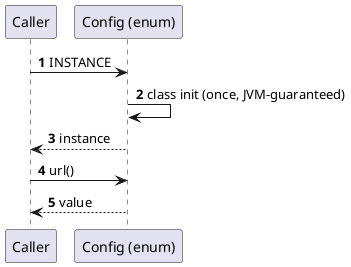

> **Placeholder content.** Written to exercise the renderer — headings, a code block, a table,
> a blockquote and an inline PlantUML diagram. Replace the prose before publishing.

A singleton guarantees one instance per process and gives you a global access point to it.
The guarantee is narrower than it looks: "per process" is not "per cluster", and not even
"per classloader".

## Minimal implementation

```java
public enum Config {
  INSTANCE;

  private final String url = System.getenv("DB_URL");

  public String url() {
    return url;
  }
}
```

The enum form is the one to reach for in Java — the JVM handles lazy init and serialization,
and it is not defeatable by reflection.

## Trade-offs

| Property | Benefit | Cost |
| --- | --- | --- |
| Global access | No wiring needed | Hidden dependency — callers do not declare it |
| Single instance | Shared cache, one connection pool | Shared mutable state across threads |
| Lazy init | Cheap startup | Init order becomes implicit and hard to trace |

## Lifecycle



> Most singletons in application code would be better as a single instance held by the DI
> container. You keep one instance without making the dependency invisible to callers.
